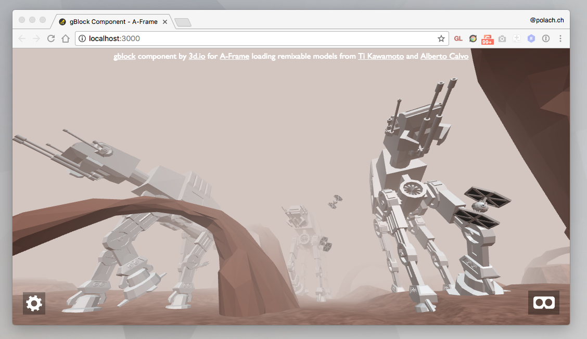

# gBlock Component for A-Frame

gBlock Component by [3d.io](https://3d.io) for [A-Frame](https://aframe.io) loading remixable [google blocks](https://vr.google.com) models.

## Demo

#### [Live demo](https://gblock.3d.io)



## Usage

```html
<head>
  <script src="https://aframe.io/releases/0.7.0/aframe.min.js"></script>
  <script src="https://rawgit.com/archilogic-com/aframe-gblock/master/dist/gblock.js"></script>
</head>
<body>
  <a-scene>
    <a-entity gblock="https://vr.google.com/objects/dVG0XJrpRJC"></a-entity>
  </a-scene>
</body>
```

#### [Run Example](https://codepen.io/tomas-polach/pen/NvJRJe/right?editors=1000)

## Want to make changes?

### Installation

#### 1. Make sure you have Node installed.

On Mac OS X, it's recommended to use [Homebrew](http://brew.sh/) to install Node + [npm](https://www.npmjs.com):

    brew install node

#### 2. Clone git repo 

    git clone https://github.com/archilogic-com/aframe-gblock.git

#### 3. Install dependencies

    npm install

#### 5. Start local development server

    npm start

#### 6. Launch site from your favourite browser:

[http://localhost:3000/](http://localhost:3000/)

## Acknowledgements

Based on [gltf component](https://aframe.io/docs/0.6.0/components/gltf-model.html) from [A-Frame](https://aframe.io/) using [GLTF loader](https://threejs.org/examples/#webgl_loader_gltf) from [three.js](https://threejs.org/).

## License

Distributed under an [MIT License](LICENSE).
